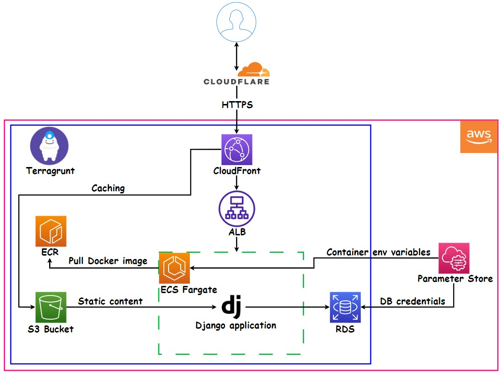
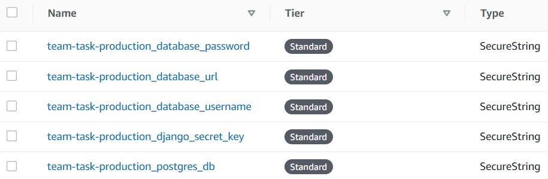

# ⏸️ Project scheme ⏸️


# ⚠️ Requirements ⚠️
* Before starting, you should install :

  - *[AWS CLI](https://docs.aws.amazon.com/cli/latest/userguide/getting-started-install.html)*
  - *[Terraform](https://developer.hashicorp.com/terraform/downloads)*
  - *[Terragrunt](https://terragrunt.gruntwork.io/docs/getting-started/install/)*

# ⚙️ Additional configuration ⚙️
* Before starting, you should perform the following actions :
 
  * create IAM user with `AdministratorAccess`;
  * edit `~/.aws/credentials` file like shown below :<br>
    *[default]<br>
    aws_access_key_id = ACCESS_KEY_FROM_THE_FIRST_STEP<br>
    aws_secret_access_key = SECRET_ACCESS_KEY_FROM_THE_FIRST_STEP<br>*
  * change S3 Bucket config in the root `terragrunt.hcl`;
  * replace all values in `production/infrastructure/common_vars.hcl` with yours :
    * `aws_region` - in which AWS Region to provision infrastructure;
    * `profile` - IAM User profile name (from the second step) used to perform all actions in AWS;
    * `project` & `environment` - your project and environment names, respectively;
    * `accound_id` - AWS Account used for infrastructure provisioning;
    * `certificate_arn` - ACM SSL Certificate ARN used for Application Load Balancer and CloudFront Distribution HTTPS requests.

# 🛄 S3 Bucket 🛄 
* Amazon S3 stores `static files` for the Django application. Also, CloudFront Distribution caches the S3 bucket's content to provide the `lowest latency` (time delay) so that content is delivered with `the best possible performance`.

# 💿 ECR 💿
* ECR module supports lifecycle policies stored in `Modules/AWS_ECR/lifecycle_policy/`. To specify what lifecycle policy to use, provide the `var.policy_json` variable, which represents the path to the json file. The default policy has `countType` set to `imageCountMoreThan` and `countNumber` set to `15`.

# 🕸️ VPC 🕸️
* VPC consists of public and private subnets, NAT gateway, and IGW. Both public and private subnets are equally distributed among all AZs. You `must` specify at least `two public subnets` (otherwise, ALB won't be created). If you are planning to use a `terragrunt (run-all) plan` make sure you specify mock outputs in `production/infrastructure/dependency_blocks/vpc.hcl` according to the desired amount of public and private subnets to create. 

# 🛡️ Security Groups 🛡️
* In our case, we need to create security groups for :
  * Application Load Balancer (80, 443 ports);
  * ECS Service (8000 port);
  * RDS Instance (5432 port).
  
* Application Load Balancer security group ports are accessible from anywhere (0.0.0.0/0).

* ECS Service security group (which will be attached to our Fargate Containers) allows incoming traffic only from the Application Load Balancer security group (only ALB can access our Django application).

* RDS Instance security group is accessible only from the ECS Service security group (only Fargate Containers can access the database endpoint).

# ㊙️ Parameter Store ㊙️
* Systems Manager Parameter Store keeps all secrets you want to `securely` use across your environment(s). As shown in the project scheme, this service `isn't managed` by Terragrunt. It's necessary not to transmit secrets in plain text inside .tf files. This means that you need to create parameters manually. Let's do it together!

* Open `Systems Manager` -> `Parameter Store` in the `same region` you specified in `production/infrastructure/common_vars.hcl` :
  * click on `Create parameter`;
  * `Name`. You `must` name parameters according to the template : `PROJECT_NAME-ENVIRONMENT_PARAMETER_NAME`. `PROJECT_NAME` & `ENVIRONMENT` are the same values as you specified in `production/infrastructure/common_vars.hcl` for `project` & `environment` in accordance. For `PARAMETER_NAME`, enter the needed value yourself;
  * for `Description` input what you wish. `Tier` - `Standart`, `Type` - `SecureString`, `Value` - fill in yourself 😉
  
* In our case, we used `project = team-task` & `environment = production` in `production/infrastructure/common_vars.hcl`, so the list with parameters in Parameter Store will look like this :



# ⚖️ Application Load Balancer ⚖️
* Elastic Load Balancing automatically distributes incoming traffic across multiple `Fargate Containers`. It monitors the health of its registered targets and routes traffic only to the healthy targets. Elastic Load Balancing scales your load balancer as your incoming traffic changes. It can automatically scale to the vast majority of workloads.

* We can't but mention that `Target Group` should be the `IP` target type as the ECS Fargate is being used. Also, you don't need to redirect traffic from the Application Load Balancer HTTP listener (80 port) to the HTTPS listener (443 port) because `CloudFront Distribution` is responsible for this action. As a result, both listeners send incoming traffic directly to the `Target Group`.

# 💾 RDS 💾
* Django application closely interacts with the Postgres database placed in a separate RDS instance. This instance `isn't publicly accessible` and is located in a `private` VPC subnet. Another thing is that RDS Service allows us to enable automated backups for the database. If needed, you can do it manually in the AWS Management Console (manual snapshot won't disappear in case of database deletion). 

* As you might have guessed, we need to pass some secrets into our configuration (`the name of the database` to create when the DB instance is created, this database is used for migration in Django; `master username` and `password`). Of course, Parameter Store will help us to solve this problem.

* In the `Parameter Store` block on the image, you can see the following parameters :
  * `team-task-production_postgres_db` contains the database name for migration in Django;
  * `team-task-production_database_username` contains the `master username` name;
  * `team-task-production_database_password` contains the `master user` password.
  
* As you remember, we used the template for parameters naming : `PROJECT_NAME-ENVIRONMENT_PARAMETER_NAME`. `PROJECT_NAME` & `ENVIRONMENT` are automatically inputted from `production/infrastructure/common_vars.hcl` `project` & `environment` variables in accordance. Therefore, `PARAMETER_NAME's are : 
  * `postgres_db`;
  * `database_username`;
  * `database_password`.
  
* Now we need to enter parameters names from the previous step as `VALUES` for `postgres_db`, `database_username`, and `database_password` `VARIABLES` into the `production/infrastructure/db_instance/terragrunt.hcl`, lines 48-50 :
```
postgres_db                     = "postgres_db"
database_username               = "database_username"
database_password               = "database_password"
```

# 🐳 ECS Fargate 🐳
* Amazon Elastic Container Service is a fully managed container orchestration service that helps you easily deploy, manage, and scale containerized applications. AWS Fargate is a technology that you can use with Amazon ECS to run containers without having to manage servers or clusters of Amazon EC2 instances. With Fargate, you no longer have to provision, configure, or scale clusters of virtual machines to run containers. This removes the need to choose server types, decide when to scale your clusters, or optimize cluster packing.

* `ECS Cluster` includes `Service with Application Load Balancer` and `auto scaling policy`, which will scale in/out containers depending on their average CPU utilization.

* By the way, we also need to pass some secrets into containers. Surprisingly, Parameter Store will help us with this!

* If you need to pass non-secret values, you should use the container definitions `environment` block (line 90 in `Modules/ECS_Fargate/main.tf`). `name` - container env variable, `value` - its value : 
```
environment = [
  { "name" : "DEBUG", "value" : "False" },
  { "name" : "DJANGO_ALLOWED_HOSTS", "value" : "*" },
  { "name" : "DEVELOPMENT_MODE", "value" : "False" }
]
```

* For secrets, you should use the container definitions `secrets` block (line 95 in `Modules/ECS_Fargate/main.tf`). `name` - container env variable, `valueFrom` - its value, taken from `Parameter Store parameter`. In the `Parameter Store` block on the image, you can see two secrets inserted into containers : `team-task-production_database_url` & `team-task-production_django_secret_key`. As you understand, we need to specify only `PARAMETER_NAME` because `PROJECT_NAME` & `ENVIRONMENT` are automatically inputted from `production/infrastructure/common_vars.hcl` `project` & `environment` variables in accordance :
```
secrets = [
  { "name" : "DATABASE_URL", "valueFrom" : "${var.project}-${var.environment}_database_url" },
  { "name" : "DJANGO_SECRET_KEY", "valueFrom" : "${var.project}-${var.environment}_django_secret_key" }
]
```
